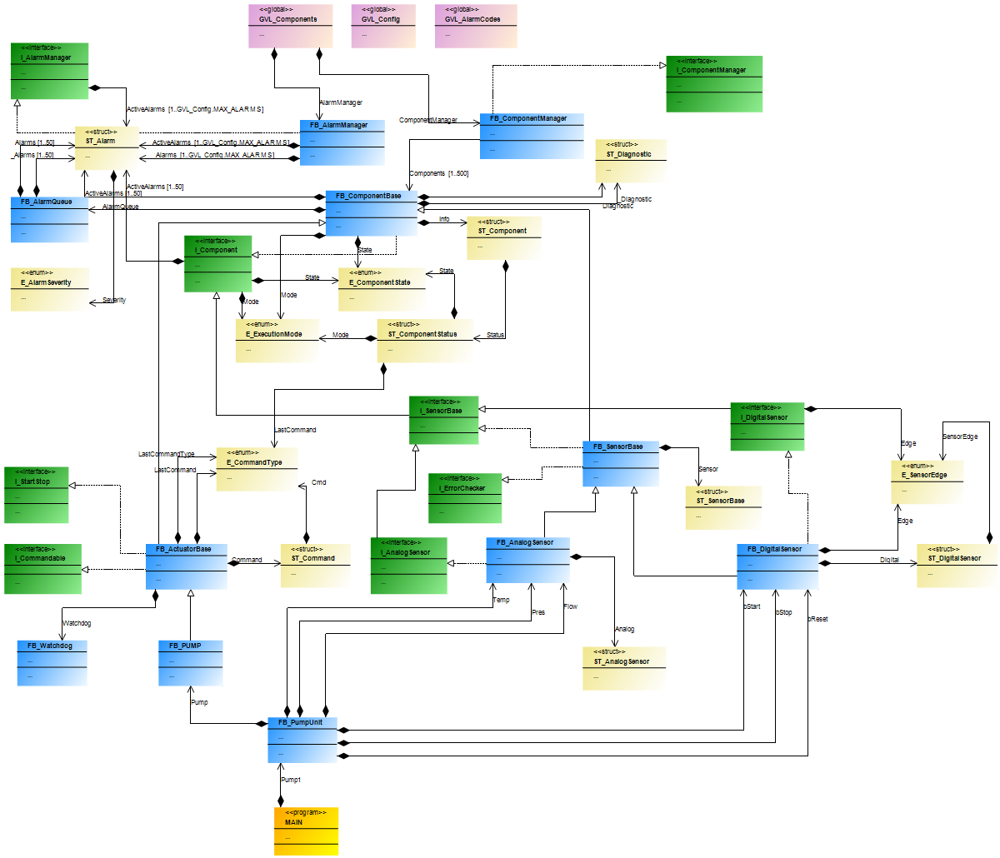

# PLC-Framework · TwinFrame


An Object-Oriented framework for IEC 61131-3 Structured Text that decouples control logic from physical hardware, enabling full logic validation before a single wire is connected.

---

## Project Status

v0.1 — Early Active Development

This framework is currently in an early development stage. While the core architecture has been implemented and validated in simulation, the codebase is not yet optimized for performance and known issues and edge-case errors still exist.

The current version should be considered a proof of architecture and design direction, not a production-ready solution. Ongoing work is focused on:

* Improving execution efficiency in real-time cycles
* Resolving stability issues in edge conditions
* Refining memory handling and pointer safety
* Expanding automated test coverage

These limitations will be progressively addressed in upcoming versions as the framework evolves toward a stable and production-grade release.

---

## UML System Diagram

<div align="center">
  
  <p><em>TwinFrame class hierarchy — generated with TwinCAT.</em></p>
</div>

---

## Operational Pipeline

`I_Component (Contract)` → `FB_ComponentBase (PackML Engine)` → `FB_SensorBase / FB_ActuatorBase` → `FB_ComponentManager (Polymorphic Loop)` → `FB_AlarmManager (Event Routing)`

---

## The Problem

Traditional PLC development has a hard dependency on physical hardware. Control logic cannot be properly tested until the cabinet is wired, field devices are installed, and the machine is mechanically complete. Bugs are found late, fixes are expensive, and commissioning timelines blow out — because the architecture makes early testing structurally impossible.

This is not a tooling problem. It is a design problem.

---

## The Solution

TwinFrame applies Software Engineering patterns native to IEC 61131-3 — Interface Segregation, the Template Method pattern, and pointer-based polymorphism — to introduce a clean **Hardware Abstraction Layer** between control logic and physical I/O. Inspired by ISA-88, the framework models machines as compositions of self-contained software cells rather than monolithic logic blocks.

The same codebase, unchanged, runs in three contexts:

| Mode | Description |
|---|---|
| **Physical** | Full production — mapped to real EtherCAT or fieldbus I/O |
| **Simulation** | Virtual Commissioning — I/O sourced from a Digital Twin |
| **SIL** | Software-in-the-Loop — driven by a deterministic test harness |

---

## Technical Architecture

The system is organized into four decoupled layers following a strict contractual model:

```
┌──────────────────────────────────────────────────────────────┐
│                  Machine Cells (Process Logic)               │
│   FB_CellUnit · SetDigitalInputs() · ProcessInputs()         │
├──────────────────────────────────────────────────────────────┤
│         FB_ComponentManager · FB_AlarmManager                │
│   UpdateAll() — pointer polymorphism across all components   │
│   AcknowledgeAll() · FilterByComponent() · event routing     │
├───────────────────────────┬──────────────────────────────────┤
│       FB_SensorBase       │        FB_ActuatorBase           │
│  FB_AnalogSensor          │   Template Method Pattern        │
│  FB_DigitalSensor         │   DoStart() · DoStop()           │
│  E_AnalogAlarm            │   DoUpdate() — override hook     │
├───────────────────────────┴──────────────────────────────────┤
│                  FB_ComponentBase  (Abstract)                │
│   PackML State Machine (26 states) · FB_AlarmQueue           │
│   FB_Watchdog · ST_Diagnostic · HAL mode                     │
├──────────────────────────────────────────────────────────────┤
│   I_Component · I_Commandable · I_StartStop · I_ErrorChecker │
│   I_Diagnostic · I_SensorBase · I_AnalogSensor               │
│   I_DigitalSensor · I_ComponentManager · I_AlarmManager      │
└──────────────────────────────────────────────────────────────┘
```

### 1. Functional Unit Layer — ISA-88 Machine Cells

Logic is organized into **Machine Cells**, each a self-contained software unit that mirrors a functional section of the physical machine. A cell aggregates its own sensors, actuators, and sequence logic — replicable across projects without modification.

The following is the actual `MAIN` task from the reference implementation, showing the full startup sequence, threshold configuration, and simulation mode in a real TwinCAT 3 runtime:

```pascal
// System orchestration — cyclic task entry point
GVL_Components.ComponentManager();
GVL_Components.AlarmManager();
GVL_Components.SystemTime(bEnable := TRUE, dwCycle := 1);
GVL_Components.CurrentDT := SYSTEMTIME_TO_DT(GVL_Components.SystemTime.systemTime);
GVL_Components.SimulationMode := TRUE;

GVL_Components.ComponentManager.UpdateAll();
GVL_Components.AlarmManager.Update();

// Startup state machine
CASE eStartupState OF

    STARTUP_INIT:
        eStartupState := STARTUP_CONFIGURE;

    STARTUP_CONFIGURE:
        // Configure FB_PumpUnit with 4-level thresholds per sensor
        Pump1.Configure(
            PresLo   := 0,   PresLoLo := 0,   PresHi  := 10,  PresHiHi := 12,
            FlowLo   := 0,   FlowLoLo := 0,   FlowHi  := 50,  FlowHiHi := 60,
            TempLo   := 10,  TempLoLo := 5,   TempHi  := 80,  TempHiHi := 90
        );
        eStartupState := STARTUP_RUNNING;

    STARTUP_RUNNING:
        // Distribute physical inputs to the cell
        Pump1.SetDigitalInputs(
            StartVal := Sim_StartButton,
            StopVal  := Sim_StopButton,
            ResetVal := Sim_ResetButton
        );

END_CASE
```

Three things are visible here that define the framework's design. The entire system — manager, alarm engine, and system clock — initialises in three lines. Threshold configuration for all sensors in a cell is expressed as a single `Configure()` call with named parameters. And `SetDigitalInputs` distributes field signals to the cell's internal components without the application layer knowing which sensor owns which input.

### 2. Orchestration Layer — The Managers

`FB_ComponentManager` executes all registered components through a single polymorphic loop via `SUPER^.Update`. `FB_AlarmManager` routes, filters, and acknowledges system-wide alarm events. Both are accessed exclusively through their interfaces, keeping the orchestration layer replaceable.

### 3. Component Hierarchy — OOP Core

`FB_ComponentBase` is the abstract root. It implements the full **PackML-aligned state machine** (26 states, 18 commands), hosts a dedicated `FB_Watchdog` instance, and embeds an `FB_AlarmQueue` for alarm storage.

`FB_ActuatorBase` applies the **Template Method pattern**: the base manages state transitions and safety; the subclass overrides `DoStart`, `DoStop`, and `DoUpdate` to implement device-specific behavior. A pump, a valve, or any future actuator only implements these three methods — safety and fault propagation are fully inherited.

`FB_AnalogSensor` adds four-level threshold monitoring (HiHi / Hi / Lo / LoLo) with a typed `E_AnalogAlarm` fault model. `FB_DigitalSensor` adds debounce timing and edge detection.

### 4. Interface Layer — Segregated Contracts

Nine segregated interfaces ensure zero coupling between layers. Process logic depends exclusively on contracts — never on concrete implementations. `I_Component` defines the full lifecycle. `I_Commandable` handles external command dispatch. `I_StartStop`, `I_ErrorChecker`, `I_SensorBase`, `I_AnalogSensor`, `I_DigitalSensor`, `I_ComponentManager`, and `I_AlarmManager` each own a single, well-defined responsibility.

---

## Engineering Challenges

**Deterministic polymorphism.** Managing a collection of pointers to `FB_ComponentBase` while guaranteeing real-time task integrity. IEC 61131-3 references cannot be stored in arrays — pointer-based storage with null-check guards on every cycle was the correct solution.

**Memory safety in real-time.** Dynamic memory allocation is not acceptable in PLC environments. The framework ensures bounded memory usage through static allocation strategies. The circular buffer for alarm storage is implemented at the `FB_AlarmManager` level, using head/tail indexing and overwrite-on-overflow semantics to guarantee deterministic behavior regardless of alarm volume.

**PackML state model complexity.** Aligning 26 states and 18 commands across a full component hierarchy while keeping state transitions consistent, safe, and inspectable without additional instrumentation.

**Interface segregation at PLC level.** Applying ISP in IEC 61131-3 requires careful separation of EXTENDS and IMPLEMENTS chains. Keeping nine interfaces coherent and non-overlapping across the inheritance tree was a significant design effort.

---

## Validated Behaviour

The framework has been deployed on a TwinCAT 3 runtime and validated against real hardware and simulation targets:

* Component Manager successfully orchestrating 15 simultaneous component instances in a 10 ms task cycle
* PackML state machine transitions validated across sensor and actuator branches
* Alarm propagation chain verified end-to-end: component fault → `FB_AlarmQueue` → `FB_AlarmManager` → acknowledgement

---

## Compatibility

| Platform | OOP Support | Status |
|---|---|---|
| TwinCAT 3.1 (Beckhoff) | Full | Tested |
| CODESYS v3.5 SP17+ | Full | Compatible |
| Siemens TIA Portal (S7-1200/1500) | Partial | Not validated |
| Rockwell Studio 5000 (Allen-Bradley) | Limited | Not validated |
| Schneider EcoStruxure (Machine Expert) | Full | Not validated |
| Omron Sysmac Studio (NJ/NX) | Full | Not validated |
| B&R Automation Studio | Full | Not validated |

---

## Repository Navigation

| Module | Technical Focus | Documentation |
|---|---|:---:|
| **Architecture** | Inheritance trees, Data Structures, PackML transitions, pointer management | [Explore](./architecture/architecture.md) |
| **Interfaces** | Contractual definitions for all 9 interfaces | [Explore](./interfaces/interfaces.md) |
| **HAL System** | Hardware Abstraction Layer and simulation buffers | [Explore](./hal/hal.md) |
| **Alarm Engine** | Circular buffer, event routing, severity model | [Explore](./alarms/alarms.md) |

---

## Roadmap

### v0.2 — Efficiency & Code Quality
Address current performance issues caused by suboptimal practices and improve overall code consistency, structure, and maintainability across the framework.

### v0.3 — OPC UA Integration (HMI/SCADA)
Implement OPC UA support to expose the framework’s data model to HMIs and SCADA systems. This includes structured mapping of:

- `ST_ComponentStatus` (operational state and control flags)  
- `ST_Diagnostic` (runtime and error information)  
- `ST_PumpIO` (process-level I/O signals for the pump cell)  

The goal is to provide a clean and consistent interface for visualization, monitoring, and supervisory control.

### v0.4 — Test Infrastructure
Integrate TcUnit to enable automated testing. The HAL simulation mode will support fully deterministic test execution with zero hardware dependency.

### v0.5 — Performance & Determinism Validation
Introduce comprehensive performance testing, including:

- Cycle time analysis  
- CPU load evaluation  
- Worst-case execution time (WCET)  
- Determinism validation  
- Scalability under high component and alarm loads  

### v1.0 — Reference Cell
Deliver a complete ISA-88 compliant machine cell with full TcUnit coverage, validated against both simulation and real hardware environments.

---

## About

TwinFrame was built to solve a recurring problem in real automation projects: control logic is rarely tested independently of hardware. Every module above has been implemented in Structured Text, deployed on TwinCAT 3, and validated against both real hardware and simulation targets.

